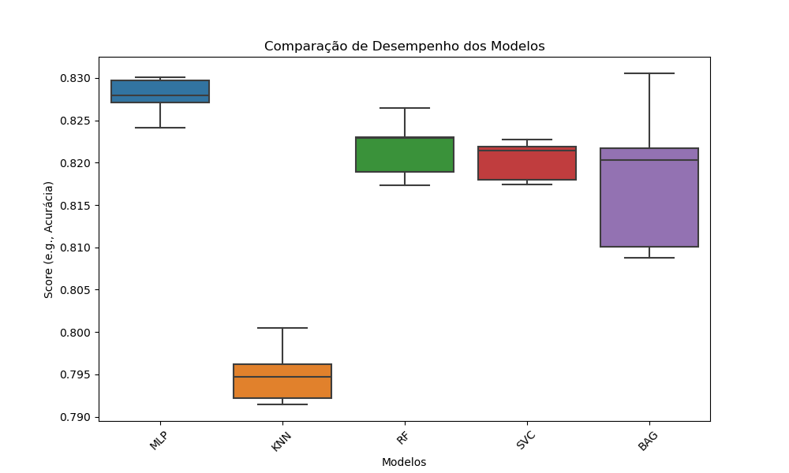

# World Of Artificial Intelligence (WAI)

## Author: Fernando Campos Silva Dal Maria

Welcome to the WAI repository where you can find a comprehensive collection of materials dedicated to the exploration and understanding of Artificial Intelligence. This repository is designed to be a valuable resource for students, educators, and AI enthusiasts looking to deepen their knowledge in the field.

### Contents

- **Lectures**: Detailed presentations covering various AI concepts and technologies. Each lecture is designed to provide a thorough understanding of its topic, complete with examples and explanations.

- **Exercises**: Hands-on exercises to help reinforce the concepts discussed in the lectures. These exercises are designed to challenge and enhance your understanding of AI.

- **Projects**: Real-world projects that allow you to apply the knowledge gained from the lectures and exercises. These projects will help you gain practical experience in AI applications.

- **AI Algorithms**: Implementation of various AI algorithms that you can study and modify. This section serves as a practical guide to understanding how AI algorithms work and how they can be applied in different scenarios.

